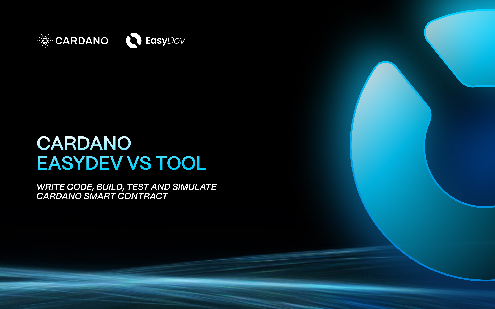

# Cardano EasyDev VS Tool



A Visual Studio Code extension that helps developers easily interact with the Cardano blockchain, with special focus on Aiken smart contract development, wallet management, and transaction simulation.

## Features

- Integrated Cardano development tools in VS Code
- Webview-based user interface for seamless interaction
- Support for smart contract development

## Prerequisites

- Visual Studio Code (version 1.87.0 or higher)
- Node.js (version 18.x or higher)
- pnpm (recommended) or npm

## Installation

1. Clone the repository:
```bash
git clone https://github.com/Innovate-Lab/cardano-easydev-vstool-frontend-extension.git
```

2. Install dependencies:
```bash
pnpm install:all
```

## Development

### Running the Extension

1. Start the development server:
```bash
pnpm watch
```

This will:
- Watch for changes in the extension code
- Watch for changes in the webview UI
- Rebuild automatically on changes

### Building for Production

```bash
pnpm compile
```

This will:
- Clean the build directories
- Compile the extension
- Build the webview UI

## Project Structure

- `src/` - Extension source code
- `webview-ui/` - React-based webview interface
- `media/` - Icons and assets
- `out/` - Compiled extension code

## Contributing

1. Fork the repository
2. Create your feature branch
3. Commit your changes
4. Push to the branch
5. Create a Pull Request

## License

This project is licensed under the terms specified in the LICENSE file.

## Support

For support, please open an issue in the GitHub repository.

## Version History

See [CHANGELOG.md](CHANGELOG.md) for version history and changes.